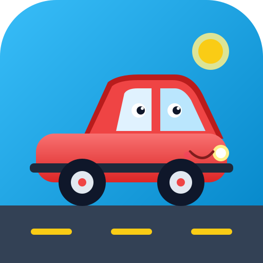

# 🚗 부릉부릉 놀이터 (BungBung Playground)

> **2~4세 유아를 위한 감각 발달 & 창의 탈것 놀이터**  
> 광고 없음 · 데이터 수집 없음 · 100% 오프라인 동작 · 부모 안심 게이트 탑재



---

## 📖 목차
1. [프로젝트 소개](#-프로젝트-소개)
2. [주요 5대 놀이 모드](#-주요-5대-놀이-모드)
3. [부모 안심 기능](#-부모-안심-기능)
4. [기술 스택](#-기술-스택)
5. [폴더 및 파일 구조](#-폴더-및-파일-구조)
6. [시작하기 & 실행 방법](#-시작하기--실행-방법)
7. [웹 PWA & Vercel 배포](#-웹-pwa--vercel-배포)
8. [Capacitor 6 모바일 앱 빌드 (Android / iOS)](#-capacitor-6-모바일-앱-빌드-android--ios)
9. [스토어 심사 컴플라이언스 (구글 가족 정책 / 애플 키즈 카테고리)](#-스토어-심사-컴플라이언스)

---

## 🎈 프로젝트 소개

**'부릉부릉 놀이터'**는 2~4세 영유아가 스스로 화면을 터치하고 조작하며 다양한 자동차와 중장비를 오감으로 체험할 수 있는 인터랙티브 놀이 앱입니다.
- **광고 제로 (No Ads)**: 유아의 몰입을 방해하거나 오터치를 유발하는 광고가 전혀 없습니다.
- **오프라인 100% 지원**: 인터넷이 없는 비행기 안, 야외, 차 안에서도 모든 그래픽과 사운드가 완벽하게 동작합니다.
- **스마트 부모 보호**: 3초 롱프레스와 한글 덧셈 퀴즈로 무단 종료 및 설정 변경을 안전하게 방어합니다.

---

## 🎮 주요 5대 놀이 모드

### 1. 🚗 자동차 정비소 (나만의 자동차 꾸미기)
- **차종 선택**: 세단, 덤프트럭, 노란버스, 스포츠카, 소방차
- **부위별 페인팅**: 차체, 지붕, 범퍼 색상을 팔레트로 자유롭게 변경
- **바퀴 & 칭찬 스티커**: 몬스터 바퀴, 번개 바퀴 및 별/하트/불꽃 스티커를 원하는 위치에 터치 부착
- 내가 완성한 자동차는 로컬 차고에 안전하게 저장되어 언제든 다시 불러올 수 있습니다.

### 2. 🛣️ 씽씽 길 그리기 (자유 도로 & 주행)
- 손가락으로 화면에 자유롭게 곡선 도로를 그리면 아스팔트 길과 중앙 차선이 생성됩니다.
- 자동차가 도로의 굴곡을 따라 자연스러운 회전 각도로 부드럽게 주행합니다.
- 자동차를 터치하면 "빵빵!" 경적 소리와 가속 사운드, 연기 파티클이 뿜어져 나옵니다.

### 3. 🔊 탈것 소리 도감 (오감 자극 사운드)
- 소방차(사이렌), 경찰차, 구급차, 버스, 포크레인, 기차, 헬리콥터, 우주 로켓 수록
- 터치할 때마다 리얼한 엔진 및 사이렌 소리와 함께 다정한 한국어 음성(TTS)으로 탈것 이름을 읽어줍니다.

### 4. 🧼 뽀득뽀득 세차장 (단계별 감각 놀이)
- **진흙탕 모험**: 화면을 문질러 자동차에 흙탕물을 묻힙니다.
- **보글보글 거품**: 브러시로 문지르면 풍성한 비누 거품과 방울 파티클이 발생합니다.
- **시원한 물뿌리기**: 샤워기로 거품과 얼룩을 말끔하게 씻어냅니다.
- **뽀송뽀송 온풍 드라이기**: 따뜻한 바람으로 물기를 말리면 반짝반짝 광택 별이 터집니다.

### 5. 🚧 안전제일 공사장 (Pixi.js 물리 & 3관절 포크레인)
- **3관절 포크레인 기구학**: 붐(Boom), 암(Arm), 버킷(Bucket)이 부드럽게 연동되어 흙을 풉니다.
- **2~3세 탭 모드 / 4세 이상 직접 드래그 모드(IK)**: 연령별 맞춤 조작 모드 제공
- **흙 알갱이 물리 엔진**: 35개의 흙 알갱이가 중력 가속도를 받고 트럭 짐칸과 바닥에 사실적으로 쌓입니다.
- **덤프트럭 & 집 짓기 4단계**: 짐칸이 100% 차면 "빵빵" 출발하여 건축 현장으로 이동해 흙을 쏟고, 4번 왕복 시 기초 ➜ 벽 ➜ 지붕 ➜ 창문에 불이 켜지며 집이 완성됩니다.

---

## 🛡️ 부모 안심 기능

1. **부모 확인 게이트 (Parental Gate)**:
   - 화면 구석 톱니바퀴를 **3초 동안 꾹 누르고** 난 뒤, `"일곱 더하기 여덟은?"` 같은 무작위 한글 덧셈 문제를 풀어야만 설정이 열립니다.
2. **아이 나이별 난이도 자동 조절**:
   - 2세, 3세, 4세 이상 설정에 따라 즉각 반응 탭 모드와 정교한 드래그 모드가 자동 적용됩니다.
3. **놀이 시간 타이머 & '차고로 가자' 취침 잠금**:
   - 타이머(10분/15분/20분/30분) 종료 시 하던 놀이를 정리하고, 차들이 하나씩 차고로 들어가며 문이 닫히고 불이 꺼집니다.
   - `"오늘도 잘 놀았어! 또 만나자"` 음성과 함께 화면이 잠기며, 부모 게이트를 통과해야만 다시 시작할 수 있습니다.
4. **Android 뒤로가기 버튼 오터치 방어**:
   - 놀이 중에는 홈으로만 이동하며, 홈 화면에서 뒤로가기를 눌러도 부모 퀴즈를 맞혀야만 종료 여부를 선택할 수 있습니다.

---

## 🛠️ 기술 스택

- **프론트엔드**: React 19, TypeScript, Vite
- **그래픽 & 물리 엔진**: Pixi.js (공사장 관절 및 흙 물리), HTML5 2D Canvas (길 그리기, 세차장)
- **오디오**: Web Audio API (합성 사운드 & Howler), Web Speech API (한국어 음성 안내)
- **스타일링**: Tailwind CSS v4
- **상태 관리 & 저장소**: Zustand, Web `localStorage`, Capacitor Preferences
- **PWA**: `vite-plugin-pwa`, Workbox 오프라인 프리캐싱
- **크로스 플랫폼 모바일**: Capacitor 6 (Android, iOS)

---

## 📁 폴더 및 파일 구조

```
bungbung-playground/
├── public/                       # PWA 아이콘 및 정적 에셋
│   ├── icon.svg                  # 고해상도 빨간 자동차 벡터 아이콘
│   ├── pwa-192x192.png           # PWA 192px 아이콘
│   ├── pwa-512x512.png           # PWA 512px 아이콘
│   ├── pwa-maskable-512x512.png  # Android 마스커블 아이콘
│   └── apple-touch-icon.png      # iOS 사파리 홈 화면 아이콘 (180px)
├── src/
│   ├── app/                      # UI 레이어 컴포넌트
│   │   ├── Home.tsx              # 홈 모드 선택 화면 (3초 부모 버튼)
│   │   ├── ModeScreen.tsx        # 놀이 모드 캔버스 마운트 컨테이너
│   │   ├── ParentGateModal.tsx   # 한글 산수 퀴즈 부모 게이트 모달
│   │   ├── SettingsModal.tsx     # 나이/음성/볼륨/타이머 및 iOS 사파리 가이드
│   │   └── BedtimeLockScreen.tsx # '차고로 가자' 취침 잠금 시퀀스
│   ├── core/                     # 핵심 로직 및 엔진
│   │   ├── audio.ts              # Web Audio 신디사이저 & TTS 엔진
│   │   ├── native.ts             # Capacitor 전체화면, 뒤로가기 제어
│   │   ├── particles.ts          # 거품, 물방울, 먼지, 축하 폭죽 파티클
│   │   └── store.ts              # Zustand 설정 및 영구 저장소
│   ├── modes/                    # 5대 놀이 모드 모듈
│   │   ├── garage/               # 자동차 정비소 (자동차 커스텀)
│   │   ├── road-draw/            # 씽씽 길 그리기
│   │   ├── sound-book/           # 탈것 소리 도감
│   │   ├── car-wash/             # 뽀득뽀득 세차장
│   │   ├── construction/         # 안전제일 공사장 (vehicles.ts, index.ts)
│   │   └── registry.ts           # 놀이 모드 레지스트리
│   ├── App.tsx                   # 최상단 라우팅 및 타이머 루프
│   └── main.tsx                  # 엔트리포인트
├── capacitor.config.ts           # Capacitor 6 네이티브 앱 설정
├── vercel.json                   # Vercel 배포 및 PWA 서비스 워커 헤더
└── vite.config.ts                # Vite & PWA 프리캐싱 빌드 설정
```

---

## 🚀 시작하기 & 실행 방법

### 1. 패키지 설치
```bash
npm install
```

### 2. 로컬 개발 서버 실행
```bash
npm run dev
```
브라우저에서 `http://localhost:3000`으로 접속합니다.

### 3. 타입 검사 및 프로덕션 빌드
```bash
npm run lint
npm run build
```

---

## 🌐 웹 PWA & Vercel 배포

### Vercel 배포 (1분 완료)
1. 코드를 GitHub 저장소에 푸시합니다.
2. [Vercel](https://vercel.com/) 대시보드에서 `New Project` ➜ 저장소를 가져옵니다.
3. Framework Preset을 `Vite`로 두고 **Deploy**를 누르면 끝납니다. (`vercel.json`에 PWA 서비스 워커 헤더가 이미 설정되어 있습니다.)

### 비행기 모드(오프라인) 테스트 방법
1. 폰 브라우저에서 배포된 웹 주소에 1회 접속합니다.
2. 부모 설정 안내대로 **'홈 화면에 추가'**를 진행합니다.
3. 폰 제어센터에서 **비행기 탑승 모드(Wi-Fi, 데이터 차단)**를 켭니다.
4. 홈 화면의 **'부릉부릉 놀이터'** 앱을 실행해도 모든 사운드와 그래픽이 100% 정상 작동합니다.

---

## 📱 Capacitor 6 모바일 앱 빌드 (Android / iOS)

### 1. 플랫폼 추가 및 최신 코드 동기화
```bash
# 최신 웹 파일 빌드
npm run build

# Android 및 iOS 프로젝트 폴더 생성 (최초 1회만 실행)
npx cap add android
npx cap add ios

# 코드 및 에셋 동기화
npx cap sync
```

### 2. Android 폰에 설치하기 (Android Studio)
1. Android Studio 열기:
   ```bash
   npx cap open android
   ```
2. 폰의 [설정] ➜ [개발자 옵션] ➜ **USB 디버깅**을 켭니다.
3. USB 케이블로 폰과 PC를 연결하고 상단 기기 목록에서 내 폰을 선택한 뒤 **▶ Run 'app'** 버튼을 누릅니다.

### 3. 아이폰에 설치하기 (Xcode - macOS 필요)
1. Xcode 열기:
   ```bash
   npx cap open ios
   ```
2. `App` 타겟 ➜ `Signing & Capabilities`에서 본인 Apple ID 계정을 선택합니다.
3. 아이폰을 맥북에 연결하고 대상 기기를 내 폰으로 지정한 뒤 **▶ Run** 버튼을 누릅니다.

> 🔊 **iOS 무음 스위치(Silent Switch) 팁**:  
> `ios/App/App/AppDelegate.swift`에 `AVAudioSession.sharedInstance().setCategory(.playback)` 코드가 포함되어 있어, 아이폰 측면의 물리 무음 스위치가 켜져 있어도 스피커로 소리가 시원하게 출력됩니다.

---

## 🛡️ 스토어 심사 컴플라이언스

본 앱은 **Google Play 가족 정책(Families Policy)** 및 **Apple App Store 키즈 카테고리(Made for Kids)** 기준을 준수합니다.

- **개인정보 보호 (COPPA / GDPR-K)**: 서버 회원가입이 없으며, 어떠한 개인 식별 정보(PII)나 광고 ID도 수집하지 않습니다.
- **광고 제로 (No Ads)**: 서드파티 광고 라이브러리가 전혀 포함되어 있지 않습니다.
- **성인 인증 게이트**: 앱 종료 및 부모 설정은 한글 산수 퀴즈를 통과해야만 접근할 수 있습니다.
- **스토어 등록 팁**: 대상 연령은 `만 5세 이하`, 광고 포함 여부는 `아니오`로 제출하시면 됩니다.

---

**부릉부릉 놀이터와 함께 아이들에게 즐겁고 안전한 놀이 시간을 선물하세요!** 🎈

## 📱 폰에 앱으로 설치해서 테스트하기

### Android (APK 다운로드)
1. GitHub 저장소 → **Actions** → **Build Android APK** 워크플로를 엽니다. (main 또는 claude/ 브랜치에 push될 때마다 자동 실행)
2. 가장 최근 실행을 눌러 아래 **Artifacts**에서 `bungbung-debug-apk`를 내려받아 압축을 풉니다.
3. `bungbung-debug.apk`를 폰으로 옮겨(카카오톡 나에게 보내기, USB 등) 누르면 설치됩니다. "출처를 알 수 없는 앱 허용"을 켜 달라고 하면 켜 주세요.
4. 디버그 서명이라 스토어 출시용은 아닙니다. 출시 때는 Android Studio에서 서명 키를 만들어 `./gradlew bundleRelease`로 AAB를 만듭니다.

Android Studio에서 직접 실행하려면:
```bash
npm install
npm run build
npx cap sync android
npx cap open android      # Android Studio가 열리면 ▶ 실행 (USB 디버깅 켠 폰 연결)
```

### iOS (Mac + Xcode 필요)
```bash
npm install
npm run build
npx cap sync ios
npx cap open ios          # Xcode → Signing & Capabilities에서 Team 선택 → 아이폰 연결 후 ▶
```
- `ios/App/App/AppDelegate.swift`에 무음 모드에서도 소리가 나도록 오디오 세션이 설정돼 있습니다.
- 처음 설치한 뒤 아이폰 설정 → 일반 → VPN 및 기기 관리에서 개발자 앱을 신뢰해 주세요.

### 웹 코드를 바꾼 뒤
`npm run build && npx cap sync` 를 다시 실행해야 앱에 반영됩니다.
